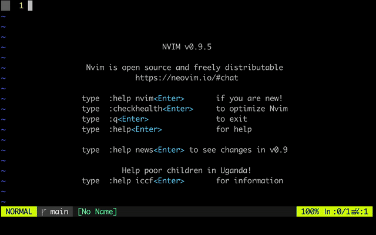
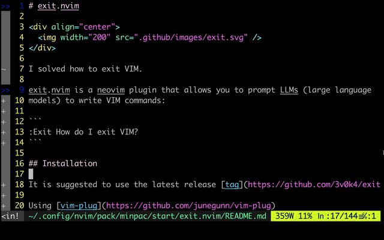

# exit.nvim

<div align="center">
  
</div>

exit.nvim is a neovim plugin that allows you to prompt LLMs (large language
models) to write Vim commands:

<div align="center">
  
</div>

Once you know how to exit Vim, you can do more useful stuff:

<div align="center">
  
</div>

## Installation

It is suggested to use the latest release [tag](https://github.com/3v0k4/exit.nvim/tags) instead of main.

Using [vim-plug](https://github.com/junegunn/vim-plug)

```viml
Plug '3v0k4/exit.nvim', { 'tag': '0.3.0' }
```

Using [dein](https://github.com/Shougo/dein.vim)

```viml
call dein#add('3v0k4/exit.nvim', { 'rev': '0.3.0' })
" or                           , { 'rev': '0.3.x' })
```

Using [packer.nvim](https://github.com/wbthomason/packer.nvim)

```lua
use {
  '3v0k4/exit.nvim', tag = '0.3.0',
}
```

Using [lazy.nvim](https://github.com/folke/lazy.nvim)

```lua
-- init.lua:
{
  '3v0k4/exit.nvim', tag = '0.3.0',
}

-- plugins/exit.lua:
return {
  '3v0k4/exit.nvim', tag = '0.3.0',
}
```

## Usage

After installing, you can type `:h exit.nvim`:

```
================================================================================
                                                                   *exit.nvim*

exit.nvim is a neovim plugin that allows you to prompt LLMs (large language
models) to write Vim commands:

  1. `:lua require('exit').setup({ model = 'openai:gpt-3.5-turbo' })`
  2. `:lua require('exit').prompt('How do I exit Vim?')`

You can set up shortcuts in your neovim config (if you configure Vim with
LUA, you don't need the first and last lines):
  >
    lua << EOF
      require('exit').setup({ model = 'openai:gpt-3.5-turbo' })

      vim.api.nvim_create_user_command('ExitModel', function(opts)
        require('exit').set_model(opts.args)
      end, { nargs = 1 })

      vim.api.nvim_create_user_command('Exit', function(opts)
        require('exit').prompt(opts.args)
      end, { nargs = '*' })
    EOF
<
With the shortcuts in place, you can prompt exit.nvim as follows:
  `:Exit How do I exit Vim?`

Or change the model with:
  `:ExitModel openai:gpt-4o`

API keys for LLMs are saved in either "$XDG_DATA_HOME/exit.nvim" or
"$HOME/.local/share/exit.nvim".

The source code is available at https://github.com/3v0k4/exit.nvim

  :h exit.setup
  :h exit.set_model
  :h exit.prompt


exit.setup({opts})                                              *exit.setup()*
  Setup function to configure what LLM to use: >
    require('exit').setup({
      model = 'openai:gpt-3.5-turbo'
    })
<
  Valid keys for {opts.model}:
    - 'openai:MODEL'
    - 'ollama:MODEL'


exit.set_model({model_id})                                  *exit.set_model()*
  Sets what LLM to use: >
    require('exit').set_model('openai:gpt-3.5-turbo')
<
  Valid keys for {model_id}:
    - 'openai:MODEL'
    - 'ollama:MODEL'


exit.prompt({prompt})                                          *exit.prompt()*
  Prompts the LLM: >
    require('exit').prompt('How do I exit Vim?')
<

 vim:tw=78:ts=8:ft=help:norl:
```

## Development

To release a new version add a tag and push:

```bash
git tag vX.Y.Z
git push --tags
```

## Contributing

Bug reports and pull requests are welcome on [GitHub](https://github.com/3v0k4/exit.nvim).

## License

The module is available as open source under the terms of the [MIT License](https://opensource.org/licenses/MIT).
